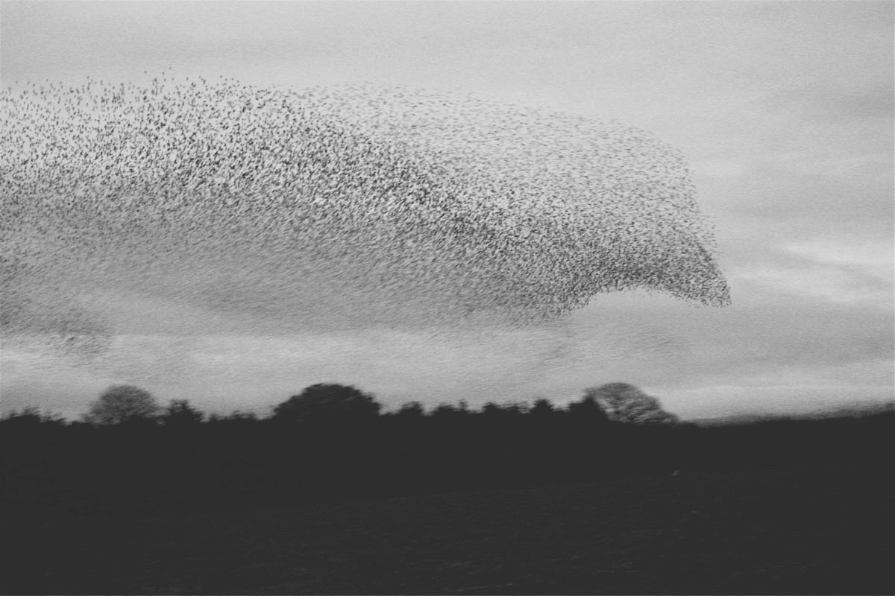

<style type="text/css">
  body {
    margin-left: 1em;
    background: whitesmoke;
    border: none;
    font-size: 14px;
  }

  figcaption {
    text-align: right;
  }


  canvas {
    background: white;
    width: 100%;

  }
  .figure {
    margin: 0;

    opacity: 0.3;
    transition: opacity .5s;
  }
    .figure--active {
      opacity: 1;
    }

  @media (min-width: 768px) {
    body {
      font-size: 16px;
    }
  }

  @media (min-width: 1300px) {
    .figure {
      position: absolute;
      left: 48em;
      padding-right: 1em;
    }

    canvas {
      background: whitesmoke;
    }
  }

  .markdown-body .codehilite pre {
    background: white;
  }

  .markdown-body h1,
  .markdown-body h2 {
    border-color: white;
  }

  .markdown-body h3 {
    margin-top: 2em;
  }
</style>

# An overview of the boids model

<figure>
  
  <figcaption>
    <em>A murmuration of starlings</em> by <a href="https://www.flickr.com/photos/aaddaamn/5196234319">Adam</a>
  </figcaption>
</figure>

Some bird types like to travel in large groups -- flocks. These flocks can be mesmerising to watch. They draw large dark shapes in the sky, that quickly move and change in unpredictable ways. The behaviour of these bird-clouds seems very complex. It must be difficult to make a simulation that displays similair behaviour, right? Can you imagine the complexity of trying to figure out the flight path of a hundred birds?

Luckily, it turns out we can do cool things without trying to control every single bird. In this article we look at a pretty well known algorithm called 'Boids', [introduced in 1987](http://www.red3d.com/cwr/papers/1987/boids.html "Flocks, Herds, and Schools:
A Distributed Behavioral Model") by [C. Reynolds](http://www.red3d.com/cwr/index.html "Craigs homepage"). It is a simple and elegant way to simulate a large amount of digital birds (which Reynolds called *boids*, as in *bird-oids*), that will behave similarly to flocks like in the picture above. At its core, the algorithm leans on two ideas. Instead of calculating a path for each boid it: 

1. defines how a boid can move -- how it turns and accelerates or how fast it can go for example,
2. calculates every frame where the boid wants to go based on its surroundings and makes it try to go there as best as rule `1.` allows.

The gist is that it defines simple rules for each boid to follow, and a much more *complex behavior emerges* from putting a large number of these boids together. This effect is also called emergent behavior.

*I hope to show you that you can make pretty cool things in Javascript without much knowledge. Aside from basic programming knowledge this article relies on ['A quick introduction to the canvas'](introduction.html#XXX), which explains how to set up a canvas, draw simple shapes, and shows how to do basic animations with this. Knowing basic vector math will be useful to fully understand the article, but should not be neccesary.*

### Setting things up

Lets start off with getting something on the screen. After we [set up the stage](introduction.html#XXX) we can draw a circle to represent a boid. It will not do anything yet -- we just give it a random position, set the radius of the boid to be 10 pixels, and draw it on the screen.

<figure for="boids_1" id="boids_1" class="figure">
  <canvas width="720" height="400">
    Your browser does not support canvas.
  </canvas>
  <figcaption>
    Drawing a single boid at a random location.
    <button onclick="rerunFigure();">rerun</button>
  </figcaption>
</figure>

```js
// this code assumes we a render context set up.

var boidRadius = 10;
var boid = { 
  position: { 
    x: Math.random() * screenWidth, 
    y: Math.random() * screenHeight 
  }
};

clear(ctx);
fillCircle(ctx, 'goldenrod', boid.position, boidRadius);
```

As you can see, whenever you run and rerun this code a single boid shows up somewhere on the screen. Nothing spectacular yet. Lets get it to move to spice things up a bit. In the next code block we add a random velocity to the boid and add that to its position inside the function `update(totalTime, elapsedTime)`. Calling `startLoop();` from the introductory article will take care of calling our `update` on a regular interval -- some 60 times a second if possible.

We define the velocity in pixels per second; a velocity of `{ x: 1, y: 0 }` will move our boid 1 pixel to the right every second. Our `update` passed `dTime` in milliseconds, so we need to divide it by `1000` before we apply it to our per-second velocity. With these kind of simulations it can be helpful to visualise things like the velocity. We achieve this by drawing a line off of our boid, so we can see where and how fast the boid is going.

<figure for="boids_2" id="boids_2" class="figure">
  <canvas width="720" height="400">
    Your browser does not support canvas.
  </canvas>
  <figcaption>
    Drawing a single moving boid.
    <button onclick="rerunFigure();">rerun</button>
  </figcaption>
</figure>

```js
// A random velocity between 0 and 20px per second in the cardinal directions. 
boid.velocity = {
  x: Math.random() * 40 - 20, 
  y: Math.random() * 40 - 20
};

function update(totalTime, elapsedTime) {
  boid.position.x += boid.velocity.x * elapsedTime / 1000;
  boid.position.y += boid.velocity.y * elapsedTime / 1000;

  clear(ctx);
  fillCircle(ctx, 'goldenrod', boid.position, 10);
  strokeLine(ctx, 'black', boid.position, boid.velocity);
}

startLoop();
```

The boid now moves across the screen, but there is room for improvement. For one, the speed we generate is not evenly distributed across direction; it gets up to `Math.sqrt(20*20 + 20*20)` pixels per second when the boid goes diagonally, but at most `20` px/s when flying in a straight horizontal or vertical line. This will hardly be noticable in our final implementation, so we will just leave it as is. A bigger problem is that the boid goes off of the screen and will never come back. We can solve this for now by making it 'wrap around' the screen by taking its position modulo the screen dimentions. 

<figure id="boids_3" for="boids_3" class="figure">
  <canvas width="720" height="400">
    Your browser does not support canvas.
  </canvas>
  <figcaption>
    A boid moves and wraps around the edges of the screenwrapping.
    <button onclick="rerunFigure();">rerun</button>
  </figcaption>
</figure>

```js
function update(time, dTime) {
  boid.position.x += boid.velocity.x * dTime / 1000;
  boid.position.y += boid.velocity.y * dTime / 1000;

  boid.position.x = (boid.position.x + screenWidth) % screenWidth;
  boid.position.y = (boid.position.y + screenHeight) % screenHeight;

  clearScreen(ctx);
  fillCircle(ctx, 'goldenrod', boid.position, 10);
  strokeLine(ctx, 'black', boid.position, boid.velocity);
}
```

### Steering clear

Now that our boid stays on the screen we can focus on the first major point of the algorithm: describing how a bird *can* move. Where the original paper focuses on real, 3d birds, we keep it much more simple. Every frame we apply a force vector on our boid, which will change its velocity. We achieve this by just adding this *steering force* to `boid.velocity`. This simplified system has a slight issue we need to solve though: our boid will accelerate every time we apply the steering and can quickly reach unreasonable speeds. We will work around this by saying that the maximum flying speed of a boid is 100px/s, and we truncate the velocity of the boid if it goes too fast.

The next example implements a `truncate(vector, limit)` function and apply a random steering force to the boid. We change the force every 5 seconds, so you can see how the boid changes directions. To get some extra insight, we will now draw the steering similarly to the velocity, but blue instead of black.

<figure id="boids_4" for="boids_4" class="figure">
  <canvas width="720" height="400">
    Your browser does not support canvas.
  </canvas>
  <figcaption>
    A boids velocity is affected by steering
    <button onclick="rerunFigure();">rerun</button>
  </figcaption>
</figure>

```js
function truncate(vector, limit) {
  var length = Math.sqrt(vector.x * vector.x + vector.y * vector.y);
  if (length > limit) {
    return { 
      x: vector.x / length * limit, 
      y: vector.y / length * limit 
    };
  }
  else {
    return vector;
  }
}

var maxSpeed = 100;
var steering = {
  x: Math.random() * 40 - 20,
  y: Math.random() * 40 - 20
};
var timeOfSteeringChange = 0;

function update(totalTime, elapsedTime) {
  var elapsedSeconds = elapsedTime / 1000;

  if (totalTime - timeOfSteeringChange > 5000) {
    steering = {
      x: Math.random() * 40 - 20,
      y: Math.random() * 40 - 20
    };
    timeOfSteeringChange = totalTime;
  }

  boid.velocity.x += steering.x * elapsedSeconds;
  boid.velocity.y += steering.y * elapsedSeconds;
  boid.velocity = truncate(boid.velocity, maxSpeed);

  boid.position.x += boid.velocity.x * elapsedSeconds;
  boid.position.y += boid.velocity.y * elapsedSeconds;

  boid.position.x = (boid.position.x + screenWidth) % screenWidth;
  boid.position.y = (boid.position.y + screenHeight) % screenHeight;

  clearScreen(ctx);
  fillCircle(ctx, 'goldenrod', boid.position, 10);
  strokeLine(ctx, 'black', boid.position, boid.velocity);
  strokeLine(ctx, 'blue', boid.position, steering);
}
```

That is it for the first half of the algorithm! We now have a bird-oid that can move around the screen and that we can steer. Before we move on with the second part of the algorithm, the actual flocking, we need to be able to work with more than one boid. To achieve this, we extract the code we wrote up until now into three functions: `createRandomBoid()`, `updateBoid(boid, steering, elapsedSeconds)` and `drawBoid(boid, color)`.

```js
function createRandomBoid(speed) {
  return {
    position: { 
      x: Math.random() * screenWidth, 
      y: Math.random() * screenHeight 
    },
    velocity: { 
      x: (Math.random() * speed * 2) - speed,
      y: (Math.random() * speed * 2) - speed 
    }
  }
}


var maxSpeed = 100;
function updateBoid(boid, steering, elapsedSeconds) {
  boid.velocity.x += steering.x * elapsedSeconds;
  boid.velocity.y += steering.y * elapsedSeconds;
  boid.velocity = truncate(boid.velocity, maxSpeed);

  boid.position.x += boid.velocity.x * elapsedSeconds;
  boid.position.y += boid.velocity.y * elapsedSeconds;

  boid.position.x = (boid.position.x + screenWidth) % screenWidth;
  boid.position.y = (boid.position.y + screenHeight) % screenHeight;
}

var boidSize = 10;
function drawBoid(boid, color) {
  fillCircle(ctx, color, boid.position, boidSize);
  strokeLine(ctx, 'black', boid.position, boid.velocity);
  strokeLine(ctx, 'blue', boid.position, steering);
}
```

This makes it easy to create, say, a 100 boids and update and draw them every frame. To better analyze what is happening, I find it useful to isolate one of the boids. So in the next example, we treat the first boid a bit differently. We draw it with a different color, and outside the loop that updates the rest of the boids. I also introduce an extra variable, `updateAll`, that will pause every boid but the first one when it is `false`. You can control it with a button under each following example.


<figure for="multiple_boids" id="multiple_boids" class="figure">
  <canvas width="720" height="400">
    Your browser does not support canvas.
  </canvas>
  <figcaption>
    A boid sees other boids close to it.
    <button onclick="updateAll = !updateAll">
      toggle updating
    </button><button onclick="rerunFigure();">rerun</button>
  </figcaption>
</figure>

```js
var boids = [];

while (boids.length < 100) {
  boids.push(createRandomBoid(40));
}

var updateAll = true;
var steering = { x: 0, y: 0 };
function update(totalTime, elapsedTime) {
  clear(ctx);

  updateBoid(boids[0], steering, elapsedTime / 1000);
  drawBoid(boids[0], 'goldenrod');

  for(var i = 1; i < boids.length; ++i) {
    if (updateAll) {
      updateBoid(boids[i], steering, elapsedTime / 1000);
    }
    drawBoid(boids[i], 'grey');
  }
}
```

### Neighbours

We now know what a boid can do, and we can have as many of them as we want flying across our screen. The next step is to figure out where each boid wants to go. Reynolds reasoned in his original paper that a bird in a flock must base this decision on the other birds it can see, and made this central to his algorithm. We continue by simulating what each boid can see.

A completely realistic bird vision simulation would be really complicated. Instead, we look for a good enough approximation. A very simple example would be to use some radius, which we will call `viewRadius`, and mark any other boid within that radius as visible:

```js
var viewRadius = 50;

function canSee(boid, other) {
  // Pytagoras!
  var horizontalDistance = neighbours[i].position.x - boid.position.x;
  var verticalDistance = neighbours[i].position.y - boid.position.y;
  var distance = Math.sqrt(horizontalDistance * horizontalDistance 
                          + verticalDistance * verticalDistance);

  return distance <= viewRadius;
}
```

To see what this does, we extend `drawBoid` a bit, to draw this visibility circle with a slightly lower opacity. We will also mark the boids visible to the first one, by making them green.

<figure for="boids_5" id="boids_5" class="figure">
  <canvas width="720" height="400">
    Your browser does not support canvas.
  </canvas>
  <figcaption>
    A boid sees other boids close to it.
    <button onclick="updateEveryBoid = !updateEveryBoid">
      toggle updating
    </button><button onclick="rerunFigure();">rerun</button>
  </figcaption>
</figure>

```js
function drawBoid(boids[i], color) {
  fillCircle(ctx, color, boid.position, boidSize);
  ctx.globalAlpha = 0.3; // This is the opacity
  fillCircle(ctk, color, boid.position, viewRadius);
  ctx.globalAlpha = 1;

  strokeLine(ctx, 'black', boid.position, boid.velocity);
  strokeLine(ctx, 'blue', boid.position, steering);
}

var steering = { x: 0, y: 0 };
function update(totalTime, elapsedTime) {
  clear(ctx);

  updateBoid(boids[0], steering, elapsedTime / 1000);
  drawBoid(boids[0], 'goldenrod');

  for(var i = 1; i < boids.lengthgth; ++i) {
    if (updateAll) {
      updateBoid(boids[i], steering, elapsedTime / 1000);
    }
    var color = 'grey';
    if (canSee(boids[0], boids[i])) {
      color = 'limegreen';
    }
    drawBoid(boids[i], color);
  }
}
```
As you can see, this already gives us some sense of surroundings. Most, if not all birds can not see directly behind them though. We can make our birds a tiny bit more realistic by taking this into account, and it turns out to not be too much effort to add. Aside from checking the distance between a boid and all the others, we also look at the angle between the direction it is flying and the direction to the other boids. We mark another boid visible only if both the distance is smaller than `viewRadius` and the angle is between `-viewAngle / 2` and `viewAngle / 2`. These two checks together yield what is called an in-sector test -- of which we conveniently can visualise the boundary using the `fillSector` function [we wrote earlier](introduction.html#XXX).

<figure for="boids_6" id="boids_6" class="figure">
  <canvas width="720" height="400">
    Your browser does not support canvas.
  </canvas>
  <figcaption>
    Boids can only see in front of them now
    <button onclick="updateEveryBoid = !updateEveryBoid">
      toggle updating
    </button><button onclick="rerunFigure();">rerun</button>
  </figcaption>
</figure>

```js
var viewRadius = 50;
var viewAngle = 1.5 * Math.PI; // 75% of a circle

function canSee(boid, other) {
  // Pytagoras!
  var horizontalDistance = neighbours[i].position.x - boid.position.x;
  var verticalDistance = neighbours[i].position.y - boid.position.y;
  var distance = Math.sqrt(horizontalDistance * horizontalDistance 
                          + verticalDistance * verticalDistance);

  var angle = Math.atan2(boid.velocity.y, boid.velocity.x) 
            - Math.atan2(verticalDistance, horizontalDistance);
  // We only care about the difference between the angle, not the direction
  angle = Math.abs(angle); 
  if (angle > Math.PI) {
    // We calculated the outer angle, but we want the inner.
    angle = Math.PI*2 - angle;
  }

  return distance <= viewRadius && angle <= viewAngle / 2;
}
```

This is as far as we will consider the visibility for right now, but note that there are other ways we could have constructed the set of visible boids. The final section of this article will discuss some alternatives, in the context of a working implementation of the algorithm.

## Please behave

We now arrive at my favorite part of algorithm; defining the behavior of our boids. We have decided how boids move and can be influenced by a `steering` force, and we defined what it knows about its surroundings. We can now finally use this to find out where a boid wants to go to and make it steer to there. The algorithm does this by combining three *steering rules*, each of them inspired on what reals birds might do.

Each of these rules take a boid and a list of all the other boids it can see. We get this list with the following straightforward function:

```js
function getVisibleBoids(boid, allBoids) {
  var visibleBoids = [];
  for (var i = 0; i < allBoids.lengthgth; ++i) {
    // The first test is there because a boid should not see itself.
    if (allBoids[i] != boid && canSee(boid, allBoids[i])) {
      visibleBoids.push(allBoids[i]);
    }
  }
  return visibleBoids;
}
```

We will now implement each rule one by one, so we can see the effect of each of them in isolation. In the examples for each of the rules, we use the outcome of that rule directly as the steering force whenever we update a boid.

The first rule we will tackle is *Separation*; the closer the boid is to another boid, the harder it wants to go to the opposite direction. The reasoning behind this is clear. We never see birds fly into each other, this rule will make our boids also try to avoid this:

<figure for="boids_7" id="boids_7" class="figure">
  <canvas width="720" height="400">
    Your browser does not support canvas.
  </canvas>
  <figcaption>
    Separation steering
    <button onclick="updateEveryBoid = !updateEveryBoid">
      toggle updating
    </button><button onclick="rerunFigure();">rerun</button>
  </figcaption>
</figure>

```js
function calculateSeparation(boid, visibleBoids) {
  var separation = { x: 0, y: 0 };
  for (var i = 0; i < visibleBoids.lengthgth; ++i) {
    var horizontalDistance = visibleBoids[i].position.x - boid.position.x;
    var verticalDistance = visibleBoids[i].position.y - boid.position.y;
    
    var distance = Math.sqrt(horizontalDistance * horizontalDistance 
                            + verticalDistance * verticalDistance);

    var size = viewRadius - distance;
    separation.x -= horizontalDistance / distance * size;
    separation.y -= verticalDistance / distance * size;
  }
  return separation;
}
```

In our implementation we use the fact that any visible other boid is at most `viewRadius` pixels away from the current boid. We calculate a vector pointing towards the visible boid, with a length of the `viewRadius` minus the distance to that boid. The resulting vector is very small when the boid is far away from us, and larger when the boid is very close. By substracting all these vectors we end up with a vector that points away from the closest boids we can see.

On to the next rule; *Alignment*. This rule states that each boid wants to fly in the same direction as the rest of the flock. Aside from wanting to follow the flock, it is also easier for a boid to avoid collisions when it is flying in the same direction as the others.

This rule is easy to implement -- we just calculate the average direction of all the visible boids and take the difference between this and the direction the current boid is flying in as the steering force.

<figure for="boids_8" id="boids_8" class="figure">
  <canvas width="720" height="400">
    Your browser does not support canvas.
  </canvas>
  <figcaption>
    Alignment steering
    <button onclick="updateEveryBoid = !updateEveryBoid">
      toggle updating
    </button><button onclick="rerunFigure();">rerun</button>
  </figcaption>
</figure>

```js
function calculateAlignment(boid, visibleBoids) {
  var sum = { x: 0, y: 0 };

  for (var i = 0; i < visibleBoids.lengthgth; ++i) {
    sum.x += visibleBoids[i].velocity.x;
    sum.y += visibleBoids[i].velocity.y;
  }

  sum.x /= visibleBoids.length;
  sum.y /= visibleBoids.length;

  return {
    x: sum.x - boid.velocity.x,
    y: sum.y - boid.velocity.y
  };
}
```

Finally, we have *Cohesion*, which makes the primary boid want to go towards the center of the group it can see. This way the flock will tend to stay together. Another interpretation provided by [Gary William Flake][XXX] is of a self defence purpose: boids that fly at the edge of the flock are easier prey. 

Our approach is similar to our implementation of *Cohesion*; we take the average position over the visible boids, instead of the velocities. We then return a force that points from the current boid to that location.

<figure for="boids_9" id="boids_9" class="figure">
  <canvas width="720" height="400">
    Your browser does not support canvas.
  </canvas>
  <figcaption>
    Cohesion steering
    <button onclick="updateEveryBoid = !updateEveryBoid">
      toggle updating
    </button><button onclick="rerunFigure();">rerun</button>
  </figcaption>
</figure>

```js
function calculateCohesion(boid, visibleBoids) {
  var sum = { x: 0, y: 0 };

  for (var i = 0; i < visibleBoids.lengthgth; ++i) {
    sum.x += visibleBoids[i].position.x;
    sum.y += visibleBoids[i].position.y;
  }

  sum.x /= visibleBoids.length;
  sum.y /= visibleBoids.length;
  
  return {
    x: sum.x - boid.position.x,
    y: sum.y - boid.position.y
  }
}
```

Now that we have the different rules implemented, all that rests us is to put them together. We just add the results up and average them out. We then calculate and apply this steering force for every boid in the update loop, and we should be done!

<figure for="boids_10" id="boids_10" class="figure">
  <canvas width="720" height="400">
    Your browser does not support canvas.
  </canvas>
  <figcaption>
    Simulation of bird-oids
    <button onclick="updateEveryBoid = !updateEveryBoid">
      toggle updating
    </button><button onclick="rerunFigure();">rerun</button>
  </figcaption>
</figure>

```js
function calculateSteering(boid, visibleBoids) {
  if (visibleBoids.lengthgth > 0) {
    var separation = calculateSeparation(boid, visibleBoids);
    var alignment = calculateAlignment(boid, visibleBoids);
    var cohesion = calculateCohesion(boid, visibleBoids);
  
    return {
      x: (separation.x + alignment.x + cohesion.x) / 3,
      y: (separation.y + alignment.y + cohesion.y) / 3
    };
  }
  else {
    return { x: 0, y: 0 };
  }
}

function update(time, dTime) {
  clear(ctx);
  for(var i = 0; i < boids.lengthgth; ++i) {
    var visibleBoids = getVisibleBoids(boid, boids);
    var steering = calculateSteering(boid, visibleBoids);
    steerBoid(boid, steering, dTime / 1000);
    moveBoid(boid, dTime / 1000);
    drawBoid(boid);
  }
}
```

## Conclusion

If you followed along, I hope you see it was not too hard to get something fun happening in javascript. It took us just a few hundred lines of code, and we did it without any libraries or weird tools. I hope to continue writing articles like these, to show more fun and interesting things you can throw together in less than a weekend. Hope to see you next time!

## Afterthoughts

The boids algorithm is very flexible and its original description very vague. For those of you that haven't had enough, I will discuss some interesting details of our implementation and some modifications you could try.

### Gainging control

The keen reader might have realised a problem in our implementation; our boids wrap around the borders of the screen, but we don't account for this in our behavior. We could solve this in our `canSee` routine (which I will leave as an exercise for you). However, the reason we needed screen wrapping at all is more interesting; we didn't want our boids to dissapear off our screen, but we do not control where they go to. Luckily, we can gain *some* control back through a natural extension of the algorithm; by adding more steering rules.

The most simple steering rule is probably one called *seek*. The intent is to drive the boid to some set point. It is really easy to implement. 

```js
function calculateSeek(boid, goal) {
  return {
    x: goal.x - boid.x,
    x: goal.y - boid.y
  };
}
```

We could even make it simpler, by reusing our cohesion rule;

```js
function calculateSeek(boid, goal) {
  return calculateCohesion(boid, [goal]);
}
```

In the next example, I have implemented a system to get the mouse position. The code for this is outside the scope of this article, but the only thing it does is give you the mouse coordinates on the canvas when you call `getMousePosition()`. If we set this to be the goal, we can control where the whole flock goes. Pretty cool!

<figure for="boids_10" id="boids_10" class="figure">
  <canvas width="720" height="400">
    Your browser does not support canvas.
  </canvas>
  <figcaption>
    Simulation of bird-oids
    <button onclick="updateEveryBoid = !updateEveryBoid">
      toggle updating
    </button><button onclick="rerunFigure();">rerun</button>
  </figcaption>
</figure>

Another fun and simple one is the *Avoid* rule. As you might have guessed, this is the same as what Separation does, but against one given point, instead of a list:

```js
function calculateAvoid(boid, predator) {
  return calculateSeparation(boid, [predator]);
}
```
To demonstrate the effect, we set the seek point to the center of the screen (so that the flock will not move off of the screen) and set the avoid point to the mouse again:

<figure for="boids_10" id="boids_10" class="figure">
  <canvas width="720" height="400">
    Your browser does not support canvas.
  </canvas>
  <figcaption>
    Simulation of bird-oids
    <button onclick="updateEveryBoid = !updateEveryBoid">
      toggle updating
    </button><button onclick="rerunFigure();">rerun</button>
  </figcaption>
</figure>

As you can see we have quite some control over the whole flock, without trying to control each individual boid. This really highlights the elegance of steering rules. They are highly modular building blocks of simple behavior, which combined allows for interesting and complex behavior.

I will mention one last example of steering rules; instead of adding one, we will swap out one. Lets look at *Separation*. To keep things straightforward, I showed you a *linear* implementation of the rule. That is to say that a visible boid that is twice as far away as another has half the influence on the resulting steering force. A popular alternative implementation is quadratic, or a boid that is `n` times closer compared to another has (about) `n*n` times more influence. As a result, birds should be able to fly closer to eachother in general, but will even less likely invade eachothers personal space.

XXXX

### Tweaking

XXX
Aside from very easy to extend, there are also a lot of paramters to play with. There are the view distance and angle, and the maximum speed, to name a few obvious ones. And with a minor modification we gain much more control over the steering, and thus over how the flock behaves. Instead of just adding the steering forces, we can introducee a weight variable for each rule. This way we can control how much, say, separation plays a role in the total behavior of the flock. The following example shows all the code we need to change to achieve this, and has some extra controls so we can change the values on the fly.

XXXX

```js
function calculateSteering(boid, visibleBoids) {
  var separationWeight = 1;
  var alignmentWeight = 1;
  var cohesionWeight = 1;
  var totalWeight = separationWeight + alignmentWeight + cohesionWeight;

  if (visibleBoids.length > 0) {
    var separation = calculateSeparation(boid, visibleBoids);
    var alignment = calculateAlignment(boid, visibleBoids);
    var cohesion = calculateCohesion(boid, visibleBoids);
  
    return {
      x: (separationWeight * separation.x + 
        alignmentWeight * alignment.x + 
        cohesionWeight * cohesion.x) / totalWeight,
      y: (separationWeight * separation.y + 
        alignmentWeight * alignment.y + 
        cohesionWeight * cohesion.y) / totalWeight
    };
  }
  else {
    return { x: 0, y: 0 };
  }
}
```
You might see some interesting effects if you play around with it for a bit. For instance, 

### Performance

This article is meant to show a very straightforward way to implement the algorithm. One of the things you would probably not want to leave in your own implementation are the unnecessary calls to `Math.sqrt()`, as it is a much more expensive operation than, say, a multiply or an addition. However, on the grand scheme of things, this will probably not you out too much. 

One important reason to reconsider how we find the boids visible to an individual one is performance. When simulating `n` boids, each boid to do `n` `canSee` checks -- `n*n` checks per frame. 

One reason to reconsider . First, since a boid determines where it steers to based on which boids it sees. Changing how we pick these thus influences the steering. By tweaking our `viewRadius` and `viewAngle` we can see our boids behave differently -- maybe with more stable flocks or different general shapes. 

### 3D

Because I wanted to keep things simple, this article describes the algorithm in 2D. There is nothing that prevents this algorithm working in 3D though. To prove this, I wrote a WebGl version you can see over [here][http://kaesve.nl/boids/index3d.html]. Going from a 2D implementation to a 3D implementation took me less than an hour -- aside from the drawing code. 

<script type="text/javascript" src="boids.js"></script>

